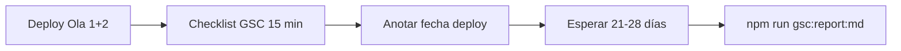

# Cambios prioritarios SEO — katialafono.cl

**Fecha:** 2026-05-20  
**Método:** evaluación paralela con 4 agentes (skills: *seo-audit*, *google-search-console*, *seo-geo*, *programmatic-seo*)  
**Fuentes:** código en repo, GSC API (28 d), informes existentes en `docs/`

**Documentos relacionados:**
- [Informe de ejecución](./informe-ejecucion-seo-2026-05-20.md)
- [Evaluación GSC completa](./gsc-evaluacion-completa-2026-05-20.md)
- [Checklist post-deploy](./gsc-checklist-post-deploy.md)

---

## Resumen ejecutivo

El sitio **ya gana visibilidad** (854 imp./28 d, +11,5%) pero **no convierte** en las URLs que más impresiones generan: home www (0,30% CTR), `/chillan/tel` y pilar infantil (0% CTR con posición 2–4). El código de las Olas 1–2 está listo; **el mayor bloqueador hoy no es falta de ideas sino falta de deploy y consolidación de URLs**.

| Dimensión | Estado código | Estado producción / GSC | Prioridad |
| --- | --- | --- | --- |
| Snippets CTR (titles/metas) | Hecho (Ola 1) | Pendiente deploy | **P0** |
| Dominio www + redirects clave | Hecho (Vercel + `next.config`) | Parcial hasta deploy | **P0** |
| Alias `canonicalPath` sin 301 | Parcial (solo `lenguaje-infantil`) | Fragmentación activa | **P1** |
| GEO / schema glosario–Chillán | Mejorado (Ola 2) | Sin medir en índice | **P1** |
| Arquitectura hubs / enlaces | Hubs OK; enlaces a alias | Cannibalización interna | **P1** |
| Medición GSC | Infra lista | Checklist humano pendiente | **P0** |

**Potencial teórico identificado (baseline GSC):** ~138 clics/mes adicionales si se cierra el gap CTR en las 8 URLs con más impresiones — solo alcanzable tras deploy + recrawl + consolidación.

---

## Top 10 cambios para potenciar SEO ahora

Ordenados por impacto esperado y dependencias. Los ítems 1–3 son **bloqueadores**; el resto se ejecuta en paralelo tras deploy.

| # | Cambio | Impacto | Esfuerzo | Agente / skill |
| --- | --- | --- | --- | --- |
| **1** | **Deploy a producción** (Ola 1 + 2: metas, 308 `/chillan/lenguaje-infantil`, `/agendar`, glosario, sitemap `lastmod`) | Crítico | Bajo (ops) | GSC + técnico |
| **2** | **Checklist GSC día 0** — warning sitemap www, URL Inspection (home, `/chillan/tel`, pilar, agendar), anotar fecha deploy | Crítico | 15 min | GSC |
| **3** | **Consolidar alias con `canonicalPath`** — 301 a pilar o dejar de enlazar; prioridad: `/fonoaudiologia-infantil-chillan`, evaluación/terapia `-chillan`, enlaces residuales a `/chillan/lenguaje-infantil` | Alto | Medio | Técnico + programmatic |
| **4** | **Alinear enlaces internos al pilar** — sustituir hub `/fonoaudiologia-infantil-chillan` por `/fonoaudiologa-ninos-chillan` en breadcrumbs de `/tratamientos/*`, `/sintomas/*`, `/servicios/*-chillan` | Alto | Medio | Programmatic |
| **5** | **Jerarquía patología hub–spoke** — pilar `/chillan/{slug}`; tratamientos/síntomas como spokes que enlazan al pilar (no al revás) | Alto | Medio | Programmatic |
| **6** | **GEO glosario dislalia/TEL** — 5 FAQs visibles = 5 en `FAQPage`; citas ASHA en schema y HTML (`<cite>`); estadística 7% TEL en JSON-LD | Medio-alto | Bajo–medio | seo-geo |
| **7** | **Fortalecer `/chillan/[slug]` para GEO** — `speakable`, breadcrumbs, 3–4 FAQs con datos, enlace a glosario | Medio | Medio | seo-geo |
| **8** | **Nav Header** — enlace visible a `/chillan` o pilar infantil + agendar (PageRank above-the-fold) | Medio | Bajo | Programmatic |
| **9** | **Query «fonoaudiologo chillan»** — H1/meta home con variante masculina; pilar + agendar sin competir con alias | Medio | Bajo | GSC + on-page |
| **10** | **Schema / OG al canonical** — `openGraph.url` y JSON-LD `@id` usan URL canónica, no alias (`lib/seo.ts` + landings) | Medio | Bajo | Técnico + GEO |

---

## Por dimensión (síntesis de agentes)

### 1. Rendimiento Search Console (skill: google-search-console)

**Diagnóstico:** 22 clics, 854 imp., CTR 2,58%, posición media 16,6. El 77% de clics es móvil; desktop arrastra posición (38,6). España: 92 imp. (11%), 0 clics — ruido, no prioridad.

**Oportunidades con más datos:**

| URL / cluster | Imp. | CTR | Acción ya en código | Medir post-deploy |
| --- | --- | --- | --- | --- |
| Home www | 337 | 0,30% | Title/meta Ola 1 | CTR ≥ 1% |
| `/chillan/tel` | 159 | 0% | Meta + title TEL | CTR ≥ 3% |
| `/fonoaudiologa-ninos-chillan` | 193 | 0% | Title corto + meta | CTR ≥ 2% |
| `/chillan/lenguaje-infantil` | 150 | 0% | 308 → pilar | Imp. consolidan en pilar |
| `/agendar-hora-...` | 82 | 0% | Title + 308 `/agendar` | ≥ 2 clics |
| Glosario dislalia/TEL | 121 | 0 clics | FAQ + enlaces Chillán | ≥ 1 clic o pos. < 40 |

**Queries sin clics (posición útil):** `fonoaudiologa` (46 imp.), `fonoaudiologia` (45 imp.), `fonoaudiologo chillan` (7 imp., pos. 2,4).

**KPIs objetivo (28 d post-deploy, ~2026-06-19):**

| KPI | Baseline | Objetivo |
| --- | --- | --- |
| Clics totales | 22 | ≥ 35 |
| CTR global | 2,58% | ≥ 3,5% |
| Posición media | 16,6 | ≤ 12 |
| CTR home www | 0,30% | ≥ 1% |
| Clics en apex | 10 | → 0 (consolidar en www) |
| Clics no-marca | ~1 | ≥ 5 |

**Criterio de cierre parcial:** al menos 2 de 3 → CTR home ≥1%, CTR tel ≥3%, clics ≥30.

---

### 2. Técnico e indexación (skill: seo-audit)

**Ya implementado bien:**

- `SITE_URL` = `https://www.katialafono.cl`; canonical en layout; 308 apex en Vercel + `next.config.ts`
- `robots.ts`: bots IA permitidos; `disallow` solo `/seo-links`; sitemap www
- `sitemap.ts`: ~71 URLs, `lastModified` 2026-05-20
- Redirects: `/agendar`, `/chillan/lenguaje-infantil`

**Hallazgos pendientes:**

| Problema | Impacto | Fix |
| --- | --- | --- |
| Código Ola 1–2 no en producción | Alto | Deploy |
| 8 alias indexables, fuera de sitemap, muy enlazados | Alto | 301 o dejar de enlazar |
| GSC: warning sitemap www, 0/64 indexadas (API), 64 vs 71 URLs | Medio | Checklist UI + reenvío sitemap |
| `openGraph.url` usa path alias, no canonical | Medio | `lib/seo.ts` |
| `/interno` noindex pero no en `disallow` | Bajo | `app/robots.ts` |

---

### 3. GEO y schema (skill: seo-geo)

**Fortalezas actuales:** `MedicalBusiness` + speakable en home; `fonoaudiologa-ninos-chillan` es la mejor página GEO; bots IA en robots; `llms.txt`; glosario Ola 2 con FAQs ampliadas.

**Gaps prioritarios:**

1. **FAQ visible ≠ FAQPage** en `/glosario/dislalia` y `/glosario/tel` (5 en schema, 3 en HTML)
2. **Sin citas ASHA/OMS** en respuestas JSON-LD de glosario estático (sí en `[slug]` dinámico)
3. **`/chillan/[slug]`** sin speakable, breadcrumbs ni estadísticas en FAQs
4. **Hubs `/glosario` y `/chillan`** sin `CollectionPage` / `ItemList` / FAQ del hub
5. **E-E-A-T:** `Person`/`Organization` sin `@id` compartido entre home, pilar y artículos

**Quick wins (< 1 día dev):**

- Renderizar las 5 FAQs en dislalia/TEL o recortar schema
- Copiar `<cite>` de `glosario/[slug]` a páginas estáticas
- `speakable` en hero de `/chillan/[slug]`
- Añadir `Bingbot` explícito en `robots.ts`
- Actualizar `public/llms.txt` con URLs post-Ola 2

---

### 4. Arquitectura y enlaces (skill: programmatic-seo)

**Mapa de pilares por intención:**

| Intención | URL pilar |
| --- | --- |
| Marca + fonoaudiología infantil Chillán | `/` |
| Especialista infantil local | `/fonoaudiologa-ninos-chillan` |
| Agendar | `/agendar-hora-fonoaudiologo-infantil-chillan` |
| Patología + geo | `/chillan` → `/chillan/{slug}` |
| Educación / GEO | `/glosario` → `/glosario/{term}` |
| Servicio clínico | `/servicios/{slug}` (sin sufijo `-chillan`) |

**Alias a no tratar como pilar** (canonical o 301):  
`/fonoaudiologia-infantil-chillan`, `/especialista-lenguaje-infantil-chillan`, `/fonoaudiologo-pediatrico-chillan`, `/evaluacion-fonoaudiologica-infantil-chillan`, `/servicios/terapia-de-lenguaje-infantil-chillan`, `/chillan/lenguaje-infantil`.

**Problema central:** cannibalización triple (misma patología en `/chillan/*`, `/tratamientos/*-chillan`, `/servicios/*`) + hub fantasma `/fonoaudiologia-infantil-chillan` enlazado masivamente mientras canonical apunta al pilar.

---

## Plan de acción por olas

### Ola A — Inmediato (día 0, sin más código obligatorio)



- [ ] Deploy producción
- [ ] Ejecutar [`gsc-checklist-post-deploy.md`](./gsc-checklist-post-deploy.md)
- [ ] Anotar fecha deploy en evaluación completa

### Ola B — Semana 1–2 (código, alto ROI)

- [x] 308 alias `canonicalPath` en `next.config.ts` (7 redirects)
- [x] Enlaces internos → pilar en tratamientos/síntomas/servicios/comparaciones (21 archivos)
- [x] FAQ visible = schema + citas ASHA en dislalia/TEL; hub glosario FAQPage + ItemList
- [x] `lib/seo.ts`: OG URL = canonical; `robots.ts` + `llms.txt`
- [x] Header «Chillán»; `/chillan/[slug]` speakable + breadcrumbs + FAQ GEO

### Ola C — Semana 3–4 (refuerzo y medición)

- [ ] Speakable + FAQs ampliadas en `/chillan/[slug]`
- [ ] Schema hub en `/glosario` y `/chillan`
- [ ] `@id` compartido Person/Organization
- [ ] Informe comparativo GSC (~2026-06-19)
- [ ] Prueba GEO manual (3 prompts ChatGPT/Perplexity)

### Backlog (decisión negocio / bajo impacto)

- Páginas `/voz-online/*` fuera de Chillán (mantener silo o noindex secundarias)
- Tráfico España (11% imp., pos. 75) — sin inversión salvo hreflang futuro
- `GSC_DASHBOARD_SECRET` en Vercel (opcional)
- `lastmod` granular por URL en sitemap

---

## Qué NO hacer ahora

| Acción | Por qué esperar |
| --- | --- |
| Reescribir de nuevo todos los titles | Ya hechos en Ola 1; medir primero |
| Crear decenas de páginas nuevas | Riesgo thin content; consolidar antes |
| Invertir en España / hreflang | 0 clics, posición 75+ |
| Confiar en 0/64 del informe sitemaps API | Inspección URL confirma indexación; validar warning en UI |
| Afirmar «sin schema» con curl | Validar con Rich Results Test o código fuente |

---

## Archivos clave para la Ola B

```
next.config.ts              # 301 alias restantes
lib/seo.ts                  # openGraph.url = canonical
lib/seo-routes.ts           # mapa canonicalPath
app/_components/Header.tsx  # nav Chillán / agendar
app/(site)/tratamientos/**  # breadcrumbs → pilar
app/(site)/sintomas/**      # idem + quitar lenguaje-infantil
app/glosario/dislalia/page.tsx
app/glosario/tel/page.tsx
app/chillan/[slug]/page.tsx
app/robots.ts
public/llms.txt
```

---

## Criterio de éxito (30 días)

| Señal | Umbral |
| --- | --- |
| Deploy + checklist GSC | Completado |
| CTR home www | ≥ 1% |
| CTR `/chillan/tel` | ≥ 3% |
| Clics totales 28 d | ≥ 30–35 |
| Impresiones alias `/fonoaudiologia-infantil-chillan` | Estables o ↓ (consolidación) |
| ≥ 1 clic o pos. < 40 en glosario dislalia/TEL | Sí |

---

*Documento generado por consolidación multi-agente (2026-05-20). Actualizar tras primera medición GSC post-deploy.*
