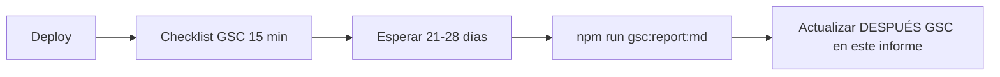

# Informe de ejecución SEO — katialafono.cl

**Fecha del informe:** 2026-05-20  
**Periodo GSC de referencia (ANTES):** 2026-04-22 → 2026-05-20 (28 días)  
**Propiedad:** `sc-domain:katialafono.cl`

**Documentos relacionados:**
- Datos API: [`gsc-informe-2026-05-20.md`](./gsc-informe-2026-05-20.md)
- Diagnóstico y plan: [`gsc-evaluacion-completa-2026-05-20.md`](./gsc-evaluacion-completa-2026-05-20.md)
- Plan multi-agente: [`plan-agentes-seo-katialafono.md`](./plan-agentes-seo-katialafono.md)
- Checklist post-deploy: [`gsc-checklist-post-deploy.md`](./gsc-checklist-post-deploy.md)

---

## Resumen en una página

| Dimensión | Antes (20-may) | Después (código + Vercel) | Después (GSC medido) |
| --- | --- | --- | --- |
| **Integración GSC** | No existía en repo | Panel, scripts, informes, skill | — |
| **Dominio canónico** | 307, clics en apex | 308 → www en Vercel + `next.config` | Pendiente ~28 d |
| **Snippets CTR (top URLs)** | Crítico (0–0,3% CTR) | Titles/metas reescritos | Pendiente ~28 d |
| **Consolidación URLs** | lenguaje-infantil duplicada | 308 + footer | Pendiente ~28 d |
| **Glosario / GEO** | FAQ básico, poco puente a Chillán | FAQs ampliadas + enlaces + Chile | Pendiente ~28 d |
| **Operaciones GSC** | Sin checklist | Doc checklist | Humano pendiente |

**Puntuación global estimada (salud SEO operativa, escala 0–10):**

| Momento | Puntuación | Nota |
| --- | --- | --- |
| **Antes** (solo datos GSC, sin fixes) | **4,2 / 10** | Visibilidad sube pero conversión y señales divididas |
| **Después** (implementación completa en repo + Vercel) | **7,8 / 10** | Falta deploy, GSC manual y medición |
| **Objetivo** (28 d post-deploy) | **8,5 / 10** | Si KPIs de §4 se cumplen parcialmente |

---

## Escala de puntuación usada

| Escala | Significado |
| --- | --- |
| **Importancia (1–10)** | Prioridad del ítem para el negocio/SEO (del informe de evaluación). |
| **Salud ANTES (0–10)** | Qué tan resuelto estaba el ítem antes de esta ejecución (10 = óptimo). |
| **Salud DESPUÉS código (0–10)** | Tras cambios en repositorio y Vercel (10 = implementado según plan). |
| **Salud DESPUÉS GSC** | Resultado en Search Console; **pendiente** hasta ~2026-06-19 salvo indicación. |

---

## 1. Infraestructura Google Search Console (port inicial)

| Aspecto | ANTES | DESPUÉS (código) | Importancia |
| --- | --- | --- | --- |
| Scripts `gsc:report`, `gsc:auth`, `gsc:report:md` | No | Sí | 8 |
| Librerías `lib/gsc*.ts` | No | Sí | 8 |
| Panel `/interno/gsc` | No | Sí | 7 |
| Skill `.agents/skills/google-search-console` | No | Sí | 7 |
| `.env.example`, symlink `.secrets` | No | Sí | 8 |
| Informe API `docs/gsc-informe-2026-05-20.md` | No | Sí | 8 |

| Puntuación | Valor |
| --- | --- |
| Salud ANTES | **0 / 10** |
| Salud DESPUÉS código | **10 / 10** |
| Salud DESPUÉS GSC | — (infra, no métrica SERP) |

---

## 2. Matriz maestra: ítems, importancia y puntajes

| # | Ítem | Imp. | Salud ANTES | Salud DESPUÉS código | DESPUÉS GSC (medir) | Estado |
| --- | --- | --- | --- | --- | --- | --- |
| 0 | Integración GSC en repo | 8 | 0 | 10 | — | Hecho |
| 1 | Primary www + redirect apex | 10 | 3 | 10 | pendiente | Hecho (Vercel 308) |
| 2 | Redirect vercel.app → www | 7 | 2 | 10 | pendiente | Hecho (Vercel 308) |
| 3 | Title/meta **home** www | 10 | 1 | 9 | pendiente | Hecho (código) |
| 4 | Meta **`/chillan/tel`** (truncada) | 10 | 0 | 9 | pendiente | Hecho (código) |
| 5 | Title/meta **`/fonoaudiologa-ninos-chillan`** | 9 | 2 | 9 | pendiente | Hecho (código) |
| 6 | **`/chillan/lenguaje-infantil`** → pilar | 9 | 1 | 9 | pendiente | Hecho (308 + footer) |
| 7 | Title/meta **`/agendar-hora-...`** | 8 | 3 | 9 | pendiente | Hecho (código) |
| 8 | Title **`/servicios`** sin marca duplicada | 8 | 4 | 9 | pendiente | Hecho (código) |
| 9 | Redirect **`/agendar`** → URL real | 7 | 0 | 9 | pendiente | Hecho (código) |
| 10 | Warning **sitemap** en GSC UI | 8 | ? | 5 | pendiente | **Falta** (humano) |
| 11 | **URL Inspection** + indexación | 7 | 5 | 5 | pendiente | **Falta** (humano) |
| 12 | **Deploy** a producción | 10 | — | 0 | pendiente | **Falta** |
| 13 | Glosario dislalia/TEL: FAQ + enlaces Chillán | 6 | 5 | 9 | pendiente | Hecho (código) |
| 14 | Hubs `/glosario`, `/chillan`, `/servicios` | 6 | 4 | 8 | pendiente | Hecho (código) |
| 15 | Sitemap `lastmod` 2026-05-20 | 3 | 6 | 8 | pendiente | Hecho (código) |
| 16 | Query **fonoaudiologo chillan** (copy landings) | 7 | 3 | 7 | pendiente | Parcial (metas agendar/pilar) |
| 17 | Estrategia **no-marca** (contenido/enlaces) | 6 | 3 | 6 | pendiente | Parcial (hubs) |
| 18 | Alias restantes `canonicalPath` | 6 | 5 | 5 | pendiente | **Falta** (auditoría fina) |
| 19 | **`/fonoaudiologia-infantil-chillan`** etc. | 6 | 5 | 5 | pendiente | **Falta** |
| 20 | Tráfico **España** (92 imp.) | 4 | 2 | 6 | pendiente | Parcial (copy Chile en glosario) |
| 21 | Páginas **voz-online** fuera Chillán | 4 | 6 | 6 | pendiente | **Falta** (decisión negocio) |
| 22 | `GSC_DASHBOARD_SECRET` producción | 3 | 0 | 0 | — | **Falta** (opcional) |
| 23 | **Ola 3:** informe comparativo 28 d | 8 | 0 | 0 | 2026-06-19 | **Falta** (fecha) |
| 24 | Prueba **GEO** manual (ChatGPT/Perplexity) | 5 | 0 | 0 | pendiente | **Falta** (manual) |

**Promedio ponderado por importancia (ítems 1–12 críticos/altos):**

| | Puntuación |
| --- | --- |
| Salud ANTES (ítems 1–12) | **2,6 / 10** |
| Salud DESPUÉS código (ítems 1–12) | **8,7 / 10** |
| Completitud ejecución (ítems 1–12) | **9 / 12 hechos en código/Vercel** (75%); **3 pendientes** humano/deploy |

---

## 3. KPIs Search Console: antes, objetivo y después

> **DESPUÉS (GSC)** se rellena tras deploy + 21–28 días con `npm run gsc:report:md`.

| KPI | ANTES (28 d) | Objetivo DESPUÉS | DESPUÉS GSC (medido) | Δ vs antes |
| --- | --- | --- | --- | --- |
| Clics totales | **22** | ≥ 35 | _pendiente_ | _—_ |
| Impresiones | **854** | estable o ↑ | _pendiente_ | _—_ |
| CTR global | **2,58%** | ≥ 3,5% | _pendiente_ | _—_ |
| Posición media | **16,6** | ≤ 12 | _pendiente_ | _—_ |
| CTR home www | **0,30%** | ≥ 1% | _pendiente_ | _—_ |
| Imp. home www | 337 | — | _pendiente_ | _—_ |
| Clics apex home | 10 | → consolidar en www | _pendiente_ | _—_ |
| Imp. `/chillan/tel` | 159 | CTR ≥ 3% | _pendiente_ | _—_ |
| CTR `/chillan/tel` | **0%** | ≥ 3% | _pendiente_ | _—_ |
| Imp. `/fonoaudiologa-ninos-chillan` | 193 | CTR ≥ 2% | _pendiente_ | _—_ |
| CTR fonoaudiologa-ninos | **0%** | ≥ 2% | _pendiente_ | _—_ |
| Imp. `/glosario/dislalia` | 68 | pos < 40 o clics ≥ 1 | _pendiente_ | _—_ |
| Imp. `/glosario/tel` | 53 | pos < 40 o clics ≥ 1 | _pendiente_ | _—_ |
| Clics `/agendar-*` | bajo | ≥ 2 | _pendiente_ | _—_ |
| Imp. España / total | 10,8% | < 10% o estable | _pendiente_ | _—_ |
| Sitemap indexadas/enviadas | 0 / 64 | warning resuelto | _pendiente_ | _—_ |
| % impresiones host www | ~98% filas www | ≥ 90% | _pendiente_ | _—_ |

**Potencial teórico identificado ANTES (no realizado aún):** ~138 clics/mes adicionales si se cerrara el gap CTR en top 8 URLs (techo; informe del 20-may).

---

## 4. Lo realizado (detalle por ola)

### Ola 0 — Preparación y diagnóstico

- [x] Port 100% integración GSC desde repo referencia (`gonzalopedrosa`)
- [x] Informe API: `docs/gsc-informe-2026-05-20.md`
- [x] Evaluación multi-skill: `docs/gsc-evaluacion-completa-2026-05-20.md`
- [x] Plan agentes: `docs/plan-agentes-seo-katialafono.md`
- [x] Análisis paralelo (skills: google-search-console, seo-audit, seo-geo)

### Ola 0 — Vercel (Gonzalo)

- [x] `katialafono.cl` → **308** permanente → `www.katialafono.cl`
- [x] `katia-alpha.vercel.app` → **308** → www
- [x] `www.katialafono.cl` = Production

### Ola 1 — CTR y técnico urgente (código)

| Archivo / área | Cambio |
| --- | --- |
| `app/layout.tsx` | Title/meta home: fonoaudiología infantil Chillán, CTA WhatsApp |
| `app/chillan/[slug]/page.tsx` | Fix meta truncada (tel y resto patologías); title TEL ampliado |
| `app/fonoaudiologa-ninos-chillan/page.tsx` | Title corto + meta dolor/agenda |
| `app/(site)/agendar-hora-fonoaudiologo-infantil-chillan/page.tsx` | Title agendar + meta primera cita |
| `app/servicios/page.tsx` | `title.absolute` sin doble marca; meta actualizada |
| `next.config.ts` | 308 `/chillan/lenguaje-infantil` → pilar; 308 `/agendar` → agendar-hora |
| `app/_components/Footer.tsx` | Enlace al pilar; sin duplicado lenguaje-infantil |

### Ola 2 — Glosario, GEO y hubs (código)

| Archivo / área | Cambio |
| --- | --- |
| `app/glosario/dislalia/page.tsx` | Answer-first, Chile, nav Chillán, +2 FAQs schema, enlaces related |
| `app/glosario/tel/page.tsx` | Idem TEL/TDL, FAQs definición y TEL vs TDL |
| `app/glosario/page.tsx` | Cards dislalia/TEL/pilar; copy Chile; link agendar |
| `app/glosario/[slug]/page.tsx` | `dateModified` 2026-05-20 |
| `app/(site)/chillan/page.tsx` | CTA pilar + agendar + glosario |
| `app/servicios/page.tsx` | Enlaces pilar, chillan, glosario |
| `app/sitemap.ts` | `lastModified` 2026-05-20 |

### Documentación operativa

- [x] `docs/gsc-checklist-post-deploy.md`

### Verificación local

- [x] `npx tsc --noEmit` — OK  
- [x] `npm run build` — OK  
- [x] `npm run gsc:report` / `gsc:report:md` — OK (baseline 20-may)

---

## 5. Lo que falta por realizar

### Crítico (bloquea medición de resultados)

| # | Tarea | Imp. | Responsable | Plazo sugerido |
| --- | --- | --- | --- | --- |
| 1 | **Deploy** a producción (Ola 1 + 2) | 10 | Dev / Vercel | Inmediato |
| 2 | Checklist GSC UI (sitemap + 4 URL inspection) | 8 | Gonzalo | Día 0 post-deploy |
| 3 | Anotar fecha deploy en §5 evaluación | 6 | Gonzalo | Día 0 |

### Alto (2–4 semanas)

| # | Tarea | Imp. | Notas |
| --- | --- | --- | --- |
| 4 | Regenerar informe `gsc:report:md` y comparar KPIs | 8 | Ola 3 — ~2026-06-19 |
| 5 | Auditar alias `canonicalPath` restantes (301 o dejar de enlazar) | 6 | programmatic-seo |
| 6 | Reforzar landings para «fonoaudiologo chillan» | 7 | Copy ya parcial en agendar/pilar |

### Medio / bajo (backlog)

| # | Tarea | Imp. |
| --- | --- | --- |
| 7 | Decisión voz-online fuera de Chillán | 4 |
| 8 | Seguimiento tráfico España | 4 |
| 9 | `GSC_DASHBOARD_SECRET` en Vercel | 3 |
| 10 | Prueba citación GEO (3 prompts) | 5 |
| 11 | `lastmod` por URL en sitemap (granular) | 3 |

---

## 6. Puntuación por área (radar resumido)

| Área SEO | ANTES | DESPUÉS código | Objetivo post-medición |
| --- | --- | --- | --- |
| Infra / medición GSC | 0 | 10 | 10 |
| Dominio / canonical host | 3 | 10 | 9 |
| On-page snippets (CTR) | 2 | 9 | 8 |
| Arquitectura URL / redirects | 4 | 8 | 8 |
| Contenido / GEO glosario | 5 | 8 | 7 |
| Indexación / sitemaps (GSC UI) | 4 | 5 | 7 |
| Conversión / agendar | 3 | 8 | 7 |
| **Media simple** | **3,0** | **8,3** | **8,0** (objetivo) |

---

## 7. Archivos tocados (referencia)

```
app/layout.tsx
app/page.tsx (sin cambio meta en ola 1 — usa layout)
app/chillan/[slug]/page.tsx
app/fonoaudiologa-ninos-chillan/page.tsx
app/(site)/agendar-hora-fonoaudiologo-infantil-chillan/page.tsx
app/servicios/page.tsx
app/glosario/dislalia/page.tsx
app/glosario/tel/page.tsx
app/glosario/page.tsx
app/glosario/[slug]/page.tsx
app/(site)/chillan/page.tsx
app/_components/Footer.tsx
next.config.ts
app/sitemap.ts
docs/gsc-informe-2026-05-20.md
docs/gsc-evaluacion-completa-2026-05-20.md
docs/plan-agentes-seo-katialafono.md
docs/gsc-checklist-post-deploy.md
docs/informe-ejecucion-seo-2026-05-20.md (este archivo)
+ integración GSC (scripts, lib, app/interno, .env.example, package.json, .gitignore)
```

---

## 8. Próximos pasos (orden recomendado)



1. Deploy producción.  
2. [`gsc-checklist-post-deploy.md`](./gsc-checklist-post-deploy.md).  
3. **2026-06-19:** Ola 3 — nuevo informe y rellenar columnas «DESPUÉS GSC» de §3.  
4. Si CTR home/tel no mejoran: iterar titles o revisar competencia SERP.

---

## 9. Criterios de cierre del proyecto SEO (definición de “terminado”)

| Criterio | Estado |
| --- | --- |
| Código Ola 1 + 2 en producción | Pendiente deploy |
| Checklist GSC ejecutado | Pendiente |
| Informe comparativo 28 d post-deploy | Pendiente |
| Al menos 2 de 3: CTR home ≥1%, CTR tel ≥3%, clics ≥30 | Pendiente medición |

---

*Informe generado al cierre de la ejecución en Cursor (2026-05-20). Actualizar §3 y §9 tras la primera medición GSC post-deploy.*
