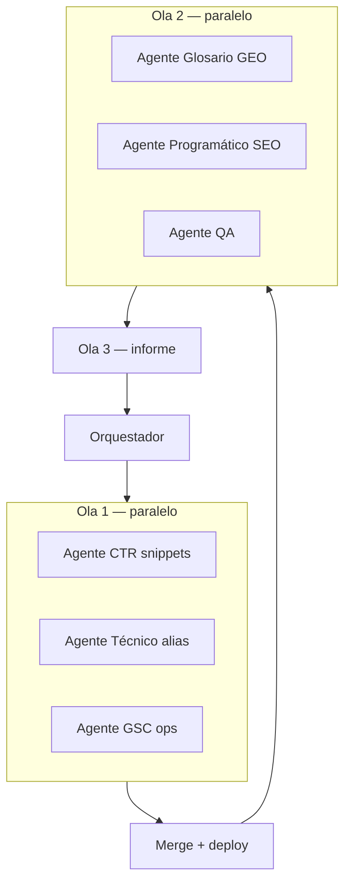

# Plan multi-agente — SEO katialafono.cl

**Baseline:** [`gsc-evaluacion-completa-2026-05-20.md`](./gsc-evaluacion-completa-2026-05-20.md)  
**Datos API:** `npm run gsc:report:md` → `docs/gsc-informe-YYYY-MM-DD.md`  
**Vercel dominios:** hecho (308 apex + vercel.app → www)

---

## Principios de división

| Regla | Motivo |
| --- | --- |
| **Paralelo** solo si no tocan los mismos archivos | Evitar conflictos de merge |
| **Secuencial** cuando B depende del diff de A | p. ej. validar después de implementar |
| **1 skill principal por agente** | Contexto enfocado; menos alucinación |
| **Entregable concreto** por agente | PR parcial, checklist, o tabla markdown |
| **Orquestador (tú / agente padre)** fusiona y decide deploy | Una sola fuente de verdad |



---

## Mapa cambio → skill → agente

| # | Cambio | Nota | Skill | Agente |
| --- | --- | --- | --- | --- |
| — | Vercel 308 www | 10 | — | **Hecho** |
| 1 | Title/meta home | 10 | `conversion-psychology` + `google-search-console` | A1 |
| 2 | Meta `/chillan/tel` | 10 | idem | A1 |
| 3 | Title/meta fonoaudiologa-ninos | 9 | idem | A1 |
| 4 | `/chillan/lenguaje-infantil` 301/enlaces | 9 | `seo-audit` + `programmatic-seo` | A2 |
| 5 | Title/meta agendar | 8 | `conversion-psychology` | A1 |
| 6 | Title `/servicios` sin duplicar marca | 8 | `seo-audit` | A1 |
| 7 | Warning sitemap GSC | 8 | `google-search-console` | A3 |
| 8 | URL Inspection + indexación | 7 | `google-search-console` | A3 (humano en UI) |
| 9 | Query fonoaudiologo chillan | 7 | `google-search-console` + `conversion-psychology` | A1 |
| 10 | Glosario FAQ + enlaces Chillán | 6 | `seo-geo` | B1 |
| 11 | Alias canonicalPath restantes | 6 | `programmatic-seo` | B2 |
| 12 | Estrategia no-marca / enlaces internos | 6 | `seo-geo` | B2 |
| 13 | Validar ruta agendar | 5 | `seo-audit` | A2 |
| 14 | España / copy geo CL | 4 | `seo-geo` | B1 |
| 15 | Voz-online fuera Chillán | 4 | `programmatic-seo` | B2 |
| 16 | lastmod sitemap | 3 | `programmatic-seo` | B2 |
| 17 | GSC_DASHBOARD_SECRET | 3 | `google-search-console` | A3 |

**Skills que NO usar para este plan:** `find-skills` (solo descubrimiento de skills).

---

## Rol del orquestador (agente padre)

**Antes de ola 1**
- Leer `docs/gsc-evaluacion-completa-2026-05-20.md` y último `docs/gsc-informe-*.md`
- Confirmar baseline en §5 del informe
- Asignar rutas de archivos por agente (evitar solapamiento)

**Después de cada ola**
- Revisar diffs; resolver conflictos en `lib/seo.ts`, layouts, páginas `app/(site)/`
- `npx tsc --noEmit` + `npm run build`
- Un solo deploy a producción

**Después de ola 3**
- Actualizar tabla «Marco de evaluación» con fecha de deploy
- Resumen en español para el usuario

---

## Ola 1 — Paralelo (máximo impacto CTR + técnico urgente)

### Agente A1 — Snippets CTR (crítico 9–10)

| Campo | Valor |
| --- | --- |
| **Skills** | `.agents/skills/conversion-psychology/SKILL.md` (CTA, claridad, urgencia moderada) + `.agents/skills/google-search-console/SKILL.md` (CTR vs benchmark por posición, límites title/meta) |
| **Tipo** | `generalPurpose` (implementación) |
| **Archivos** | `app/page.tsx`, `app/(site)/chillan/tel/page.tsx`, `app/(site)/fonoaudiologa-ninos-chillan/`, `app/(site)/agendar-hora-fonoaudiologo-infantil-chillan/`, `app/(site)/servicios/page.tsx`, metadata en `lib/seo.ts` si aplica |
| **NO tocar** | `app/sitemap.ts`, redirects, glosario |

**Prompt base (copiar):**
```markdown
Implementa solo metadata (title, description, openGraph si existe) para katialafono.cl según informe GSC 2026-05-20.

Lee: .agents/skills/conversion-psychology/SKILL.md, .agents/skills/google-search-console/SKILL.md (sección CTR benchmarks y low CTR workflow), docs/gsc-evaluacion-completa-2026-05-20.md §2.3 y §4 P0 filas 4-6.

URLs y datos GSC:
- / : 337 imp, CTR 0,30%, pos ~3
- /chillan/tel : 159 imp, 0% CTR — corregir meta truncada
- /fonoaudiologa-ninos-chillan : 193 imp, 0 clics
- /agendar-hora-fonoaudiologo-infantil-chillan : 82 imp
- /servicios : quitar marca duplicada en title

Reglas: español Chile, mencionar Chillán donde aplique, title ≤60 car preferible, meta 150-155 car, sin cambiar landings NOINDEX ni cuerpo largo de página salvo H1 si está desalineado.

Entregable: lista URL → title/meta anterior → nuevo; verificar con curl grep title y description.
```

---

### Agente A2 — Técnico alias y canonical (crítico 9)

| Campo | Valor |
| --- | --- |
| **Skills** | `.agents/skills/seo-audit/SKILL.md` (crawlability, canonical) + `.agents/skills/programmatic-seo/SKILL.md` (páginas plantilla, consolidación) |
| **Tipo** | `generalPurpose` |
| **Archivos** | `next.config.ts` (redirects), páginas con `canonicalPath` en chillan, `app/_components/` enlaces internos, `lib/seo.ts` |
| **NO tocar** | titles de A1, glosario contenido |

**Prompt base:**
```markdown
Resuelve consolidación SEO técnica según docs/gsc-evaluacion-completa-2026-05-20.md.

Skills: seo-audit (prioridad crawlability), programmatic-seo (consolidar URLs programa).

Tareas:
1. /chillan/lenguaje-infantil → 301 a /fonoaudiologa-ninos-chillan O dejar de enlazar desde Header/Footer/sitemap si ya tiene canonicalPath
2. Auditar otras páginas con canonicalPath (fonoaudiologia-infantil-chillan, especialista-lenguaje-infantil-chillan, etc.)
3. Verificar ruta /agendar vs /agendar-hora-fonoaudiologo-infantil-chillan (GSC NEUTRAL en /agendar)
4. Enlaces internos: priorizar URLs canónicas www

Entregable: tabla URL | acción (301/enlace/sitemap) | archivos tocados. Ejecutar curl -sI en redirects nuevos.
```

---

### Agente A3 — Operaciones GSC (humano + documentación)

| Campo | Valor |
| --- | --- |
| **Skills** | `.agents/skills/google-search-console/SKILL.md` (sitemaps, URL inspection, checklist mensual) |
| **Tipo** | `generalPurpose` o **humano** para UI |
| **Archivos** | Solo `docs/` (checklist operativo); no código |

**Prompt base:**
```markdown
Genera checklist operativo GSC post-deploy para katialafono.cl.

Skill: google-search-console (sitemaps, indexing, inspection workflow).

Basado en docs/gsc-evaluacion-completa-2026-05-20.md §6.

Incluir:
1. Pasos UI para warning sitemap www (qué buscar en cada pantalla)
2. Lista URL Inspection con criterio PASS/NEUTRAL y cuándo "Solicitar indexación"
3. Qué anotar en tabla §5 del informe de evaluación
4. Cuándo volver a correr npm run gsc:report:md (D+21)

NO implementar código. Salida: docs/gsc-checklist-post-deploy.md
```

**Nota:** La UI de Search Console la ejecuta **Gonzalo**; el agente solo documenta.

---

## Ola 2 — Paralelo (después de merge + deploy ola 1)

**Estado 2026-05-20:** implementada en código (B1 glosario, B2 sitemap/hubs). Pendiente deploy + B3 QA en producción.

### Agente B1 — Glosario + GEO

| Campo | Valor |
| --- | --- |
| **Skills** | `.agents/skills/seo-geo/SKILL.md` (schema, GEO citabilidad, AI bots ya OK en robots) |
| **Archivos** | `app/(site)/glosario/**`, JSON-LD en páginas glosario |

**Prompt base:**
```markdown
Mejora GEO y orgánico del glosario (dislalia, tel) según skill seo-geo.

Datos GSC: /glosario/dislalia 68 imp pos 79, /glosario/tel 53 imp pos 73, 0 clics.

Tareas:
- FAQPage JSON-LD (3-5 preguntas del informe queries)
- Párrafo answer-first 40 palabras
- Enlaces prominentes a /chillan/dislalia, /chillan/tel, /agendar-hora-...
- Copy: Chillán, Chile (reducir ruido España sin hreflang aún)

NO cambiar landings Chillán de A1. Entregable: diff + lista prompts GEO para probar en ChatGPT/Perplexity.
```

---

### Agente B2 — Programático + enlaces + sitemap

| Campo | Valor |
| --- | --- |
| **Skills** | `.agents/skills/programmatic-seo/SKILL.md` + `seo-geo` (keyword clusters) |
| **Archivos** | `app/sitemap.ts`, hub `/servicios`, `/chillan`, internal links, páginas voz-online si aplica |

**Prompt base:**
```markdown
Skill programmatic-seo: optimizar arquitectura y descubrimiento sin crear páginas nuevas.

Tareas:
1. Revisar lastmod en sitemap.ts (fecha real por grupo o por deploy)
2. Hub enlaces: fonoaudiologa/fonoaudiologia no-marca → pilares indexables
3. Informe breve: páginas voz-online con clics fuera Chillán — mantener o noindex secundarias

Coordinar con cambios A2 (no duplicar redirects).
```

---

### Agente B3 — QA técnico

| Campo | Valor |
| --- | --- |
| **Skills** | `seo-audit` (verificación) |
| **Tipo** | `explore` o `generalPurpose` readonly primero |

**Prompt base:**
```markdown
QA post-olas 1-2 katialafono.cl.

Ejecutar: npx tsc --noEmit, npm run build, curl redirects (apex, vercel.app, lenguaje-infantil), curl title/meta de 5 URLs críticas.

Comparar con baseline docs/gsc-evaluacion-completa-2026-05-20.md.

Salida: pass/fail + regresiones. No arreglar — solo reportar.
```

---

## Ola 3 — Secuencial (un agente)

### Agente C1 — Medición y cierre

| Campo | Valor |
| --- | --- |
| **Skills** | `google-search-console` |
| **Comandos** | `npm run gsc:report`, `npm run gsc:report:md` |

**Prompt base:**
```markdown
Regenera informe GSC y actualiza evaluación.

1. npm run gsc:report:md
2. Comparar KPIs vs baseline 2026-05-20 en docs/gsc-evaluacion-completa-2026-05-20.md
3. Crear docs/gsc-evaluacion-completa-YYYY-MM-DD.md o actualizar §5 tabla resultados
4. Resumen ejecutivo: qué mejoró, qué sigue igual, próximos 30 días

Skills: google-search-console metodología y checklist mensual.
```

---

## Matriz de dependencias

| Agente | Depende de | Puede ir en paralelo con |
| --- | --- | --- |
| A1 | — | A2, A3 |
| A2 | — | A1, A3 |
| A3 | — | A1, A2 (solo docs) |
| B1 | Merge ola 1 | B2, B3 |
| B2 | Merge ola 1 | B1, B3 |
| B3 | A1 + A2 (+ B1 B2 si existen) | — (último en ola 2) |
| C1 | Deploy producción | — |

---

## Asignación de skills (referencia rápida)

| Skill | Usar para | No usar para |
| --- | --- | --- |
| **google-search-console** | KPIs, CTR gaps, informes API, sitemaps, inspección, checklist mensual | Escribir copy emocional largo |
| **seo-audit** | Redirects, canonical, robots, verificación curl, prioridad indexación | Estrategia de keywords masiva |
| **seo-geo** | Schema JSON-LD, GEO/citabilidad, bots IA, clusters keyword | Implementar redirects masivos |
| **programmatic-seo** | Sitemap, hubs, alias, muchas URLs plantilla | Análisis de datos GSC |
| **conversion-psychology** | Titles/metas/CTA que convierten en SERP | Informes de indexing API |

---

## Orden de ejecución recomendado (copiar en Cursor)

```
1. [Paralelo] Lanzar A1 + A2 + A3
2. [Orquestador] Merge → tsc → build → deploy
3. [Humano] Checklist A3 en Search Console UI
4. [Paralelo] Lanzar B1 + B2
5. [Orquestador] Merge → deploy
6. [Secuencial] B3 QA
7. [Esperar 21-28 días]
8. [Secuencial] C1 informe + actualizar evaluación
```

---

## Estimación de esfuerzo

| Ola | Agentes | Tiempo agente | Tiempo humano |
| --- | --- | --- | --- |
| 1 | 3 | 15–40 min c/u | 15 min GSC UI |
| 2 | 3 | 20–45 min c/u | — |
| 3 | 1 | 10 min | Revisar informe |

---

## Criterios de éxito (28 días post-deploy ola 1)

| Métrica | Baseline 20-may | Objetivo |
| --- | --- | --- |
| Clics | 22 | ≥ 35 |
| CTR home www | 0,30% | ≥ 1% |
| CTR /chillan/tel | 0% | ≥ 3% |
| Imp. solo en www (hosts) | mixto | ≥ 90% filas www |
| Warning sitemap | 1 | 0 o documentado |

---

*Plan generado 2026-05-20. Ajustar fechas al lanzar cada ola.*
